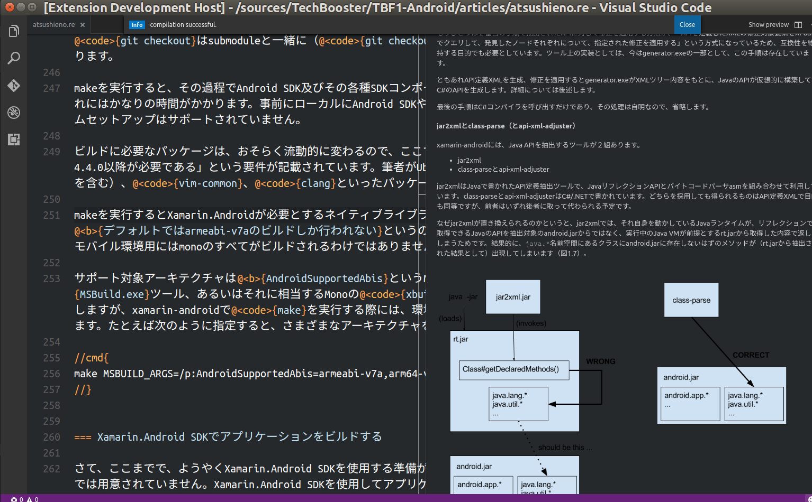
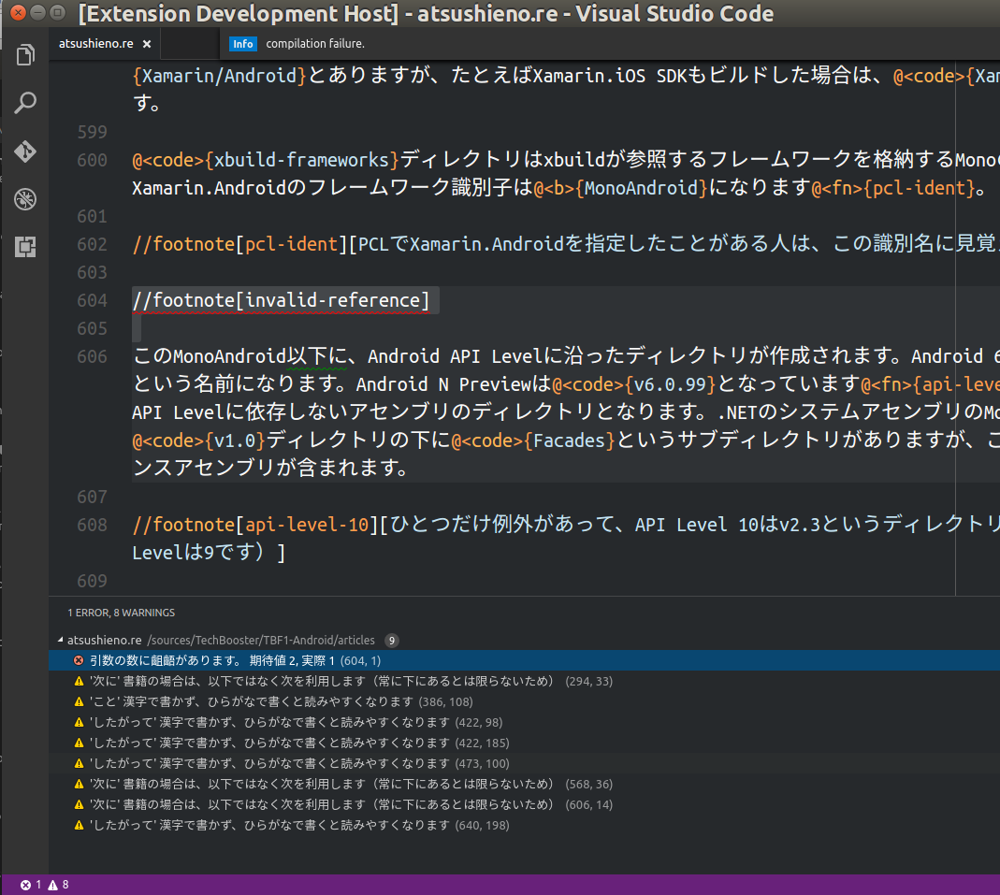
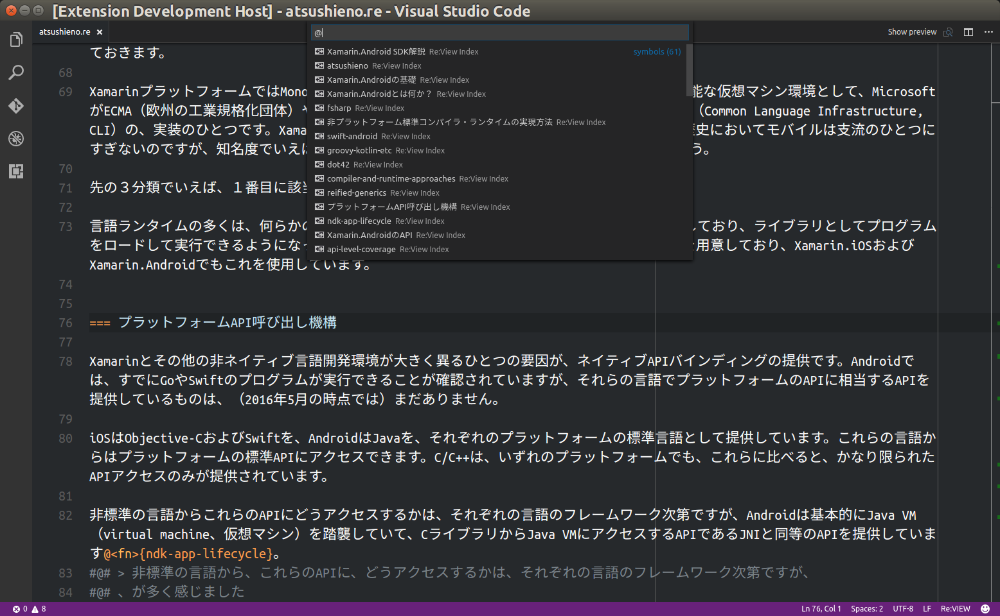

# Important Updates on v0.6.0

Version 0.6.0 drops the bundled support for [prh](https://github.com/prh) because there is now a standalone package for it. If you miss the validation feature, please install "prh" extension.

# What is vscode-language-review?

vscode-language-review is a [Visual Studio Code](https://github.com/Microsoft/vscode/) extension for [Re:VIEW](https://github.com/kmuto/review) markup language.

The extension features:

- Live preview on edits.

- Diagnostic reports on save and preview. If you would also like proof-reading helper, use [vscode-prh-extension](https://github.com/prh/vscode-prh-extention).

- List document sections and jump to them.

# How to Build and Run when debugging this extension

- Check out this repository.
- Run `npm install` for the first build.
- Launch VSCode, use "Open Folder" command to open this directory (that contains this README.md).
- Type `F5` key.

# Known Issues

Check out [github issues](https://github.com/atsushieno/vscode-language-review/issues).

# License

The primary license is MIT (see [LICENSE.md](LICENSE.md)). Note that this repository and the extension binary package also contain third-party sources, namely:

- syntaxes/review.tmLanguage is taken from [yanzm/ReVIEW](https://github.com/yanzm/ReVIEW), Apache License Version 2.0
- review.js, packaged in the binary distribution of this extension, is taken from [vvakame/review.js](https://github.com/vvakame/review.js), MIT License.
- and all the subsequent dependencies are packaged in the extension too.

# Other projects

- https://github.com/erukiti/ya-language-review also provides Re:VIEW preview and diagnostic features. It runs `review` locally (while my extension is based on review.js) so you can get the very latest features, in case you need them.
